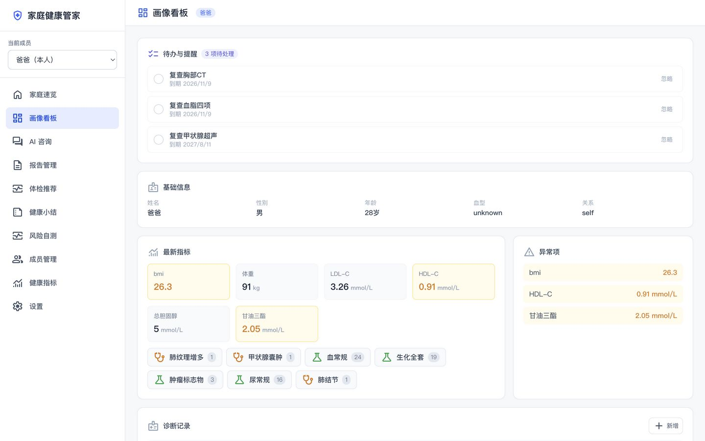
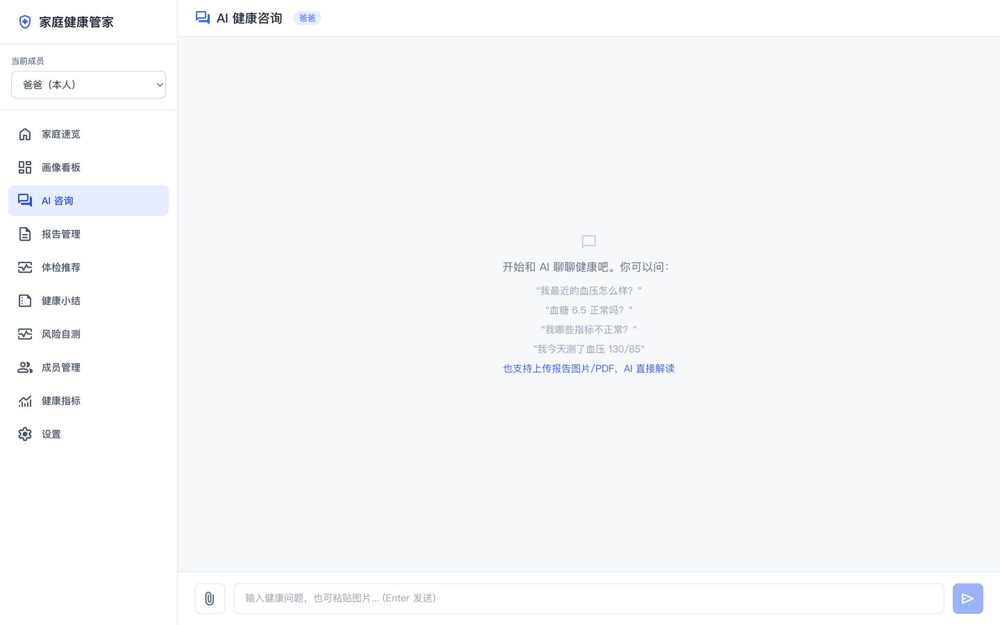
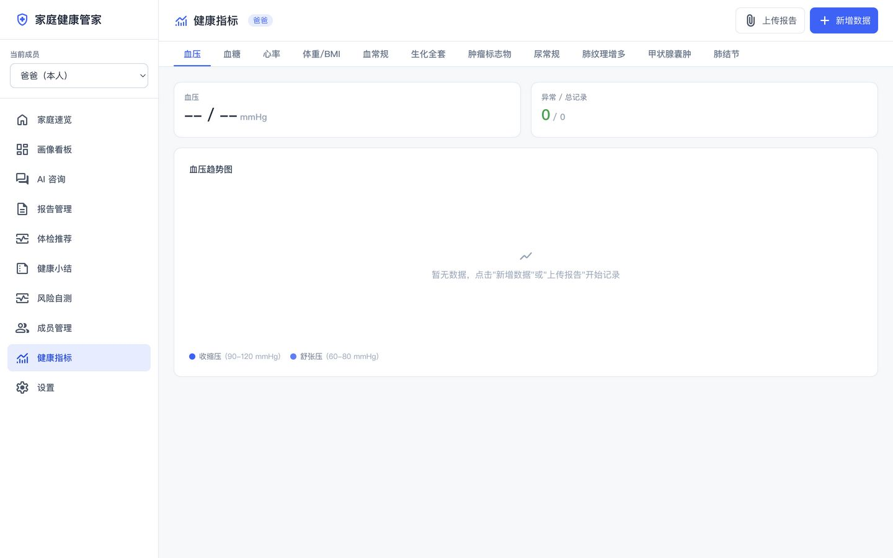

# AI Health Steward | 本地 AI 健康管家
[English](README_EN.md)


> 开源、可私有化部署的家庭 AI 健康管家。通过多模态大模型将健康数据结构化为人维度画像，提供可视化看板与 AI 咨询能力，支持飞书等渠道的资料收集与轻问答。
>
> **产品定位：双入口协同。** WebUI 是家庭健康管理的**完整后台**（画像看板、报告管理、体检推荐、系统设置等深度能力）；飞书是日常高频的**轻入口**（随手丢报告、文字轻问答、快捷录入），尤其适合移动端随手使用。飞书侧重“便捷触达与资料收集”，WebUI 侧重“深度管理与完整闭环”，数据在两者间自动回流共享。

[](LICENSE)
[](https://wangzhengpengjay.github.io/AI-Health-Steward/)

> 📖 **在线介绍页**：[wangzhengpengjay.github.io/AI-Health-Steward](https://wangzhengpengjay.github.io/AI-Health-Steward/) — 项目功能与产品理念的图形化落地页

## 特性

- **本地私有部署** — 健康数据存储在本地，自主可控
- **多模态报告导入** — 拍照上传体检报告/化验单/处方，AI 自动结构化抽取关键指标
- **人维度健康画像** — A-H 全字段族（基础信息/生理指标/诊断/用药/过敏/生活方式/家族史/数据溯源），作为单一事实来源
- **AI 健康咨询** — 意图路由 + 工具调用，回答基于你的实际画像数据，非通用 chatbot
- **指标趋势可视化** — 血压/血糖/血脂/心率/体重 BMI 趋势图，异常标识
- **个性化体检推荐** — 基于健康画像，按 1+X+Y 三层逻辑（基础核心集/现状深度专项/风险预警专项）生成定制化体检方案，支持预算档位选择与安全禁忌排查
- **飞书渠道集成** — 支持配置多个飞书 Bot，每个渠道绑定一个家庭成员；通过 WebSocket 长连接接收消息，支持文字轻问答与图片报告解析
- **模型可插拔** — 多模态 API（必选）/ 文字 API（可选）/ 本地 LLM（可选），按需配置
- **家庭多成员** — 单实例服务一个家庭，成员数据隔离
- **报告管理** — 报告全生命周期管理（上传→AI抽取→确认入档→归档），支持从报告管理页、指标管理页、AI 咨询页三个入口上传，入档数据自动归入健康画像
- **检验检查追踪** — 检验指标按报告分组独立曲线追踪，检查异常发现按分类时间轴展示
- **AI 图片解读** — 咨询中发送报告图片，AI 先多模态抽取结构化数据，再基于数据做专业解读，同时支持一键入档
- **报告语义检索 (RAG)** — 入档报告自动向量化，AI 咨询可语义检索历史报告内容回答问题
- **系统设置** — 前端可视化管理模型配置、健康检测、数据导出/清除，配置即时写入生效
- **家庭健康速览** — 默认首页一屏聚合全家健康状态（危急值/异常项/数据记录），点击直达成员画像
- **年龄分档参考范围** — 血压/血糖/心率等按成人/儿童自动匹配正常范围，避免误判儿童指标异常
- **危急值预警** — 采用临床危急阈值（如血压≥180/110、血糖≥16.7），在画像看板以红色横幅提示尽快就医
- **长期会话记忆** — 每次咨询后增量压缩为成员长期记忆，跨会话记住病情、用药、偏好与待跟进事项
- **访问鉴权 + 限流** — 可选 Bearer Token 保护全部业务接口，按成员对话限流防止接口被刷
- **成本优化** — 消除对话中重复的指标抽取 LLM 调用，单次会话仅做一次必要的模型调用；无更新的健康小结直接输出缺省页不浪费 LLM 调用
- **生产部署支持** — 内置 `docker-compose.prod.yml` 生产配置（无热重载/无轮询/DEBUG=false），用户数据按成员/年/月目录组织存储
- **复测/用药待办提醒** — 基于危急值、异常指标、在用药、慢病诊断与体检推荐自动生成待办任务（复查/用药/随访/预约），看板与首页一键查看
- **健康小结/周期报告** — 按周/月/年**定期自动触发**（自然周后一天/每月1号/每年1月1日自动生成上周/上月/去年小结）+ 手动触发，指标趋势/异常事件/建议汇总，规则统计 + 可选 LLM 解读，复查项自动落成待办；无更新的周期直接输出缺省页不浪费 LLM 调用
- **风险自测量表** — 内置 9 大量表（PHQ-9 抑郁、GAD-7 焦虑、糖尿病风险、ASCVD 心血管、ISS 失眠、高血压风险、血脂异常、AD8 认知功能、卒中风险），对话中或 /assess 页面自助测评，计分分档与频控

## 产品定位与使用场景

面向**单家庭、私有化部署**的健康管理场景，产品围绕“一份画像、两个入口”展开：

### 入口一：WebUI（完整后台 · 总部）

| 场景 | 说明 |
|------|------|
| 健康画像看板 | 全家人一屏速览，含危急值红色预警、异常项与趋势 |
| 报告管理与入档 | 上传 → AI 抽取 → 人工确认 → 入档，数据归入画像 |
| 指标趋势与录入 | 血压/血糖/血脂/心率/体重 BMI 趋势图、参考范围分档 |
| 个性化体检推荐 | 按 1+X+Y 逻辑生成体检方案，支持预算档位与安全禁忌排查 |
| 健康小结 | 周/月/年周期自动生成指标趋势、异常事件与建议汇总 |
| 风险自测 | PHQ-9/GAD-7/糖尿病/心血管量表自助测评与历史跟踪 |
| 待办与提醒 | 复测/用药/随访/体检预约任务看板，一键完成 |
| 系统设置 | 模型配置、数据导出/清除、飞书渠道管理 |

### 入口二：飞书（轻入口 · 随手用）

| 场景 | 说明 |
|------|------|
| 文字轻问答 | 随时问“我这个血压正常吗”“高血压该注意什么”，基于画像回答 |
| 随手丢报告 | 拍照发图片/PDF 报告，AI 自动解析并归入对应成员画像 |
| 快捷录入 | 对话中直接说指标数值，自动记录并回填画像 |
| 家庭多成员 | 每个飞书 Bot 绑定一个家庭成员，消息自动归属 |

### 价值分工

> **飞书负责“便捷触达与资料收集”，WebUI 负责“深度管理与完整闭环”。**
> 日常在飞书随手记录和提问，需要深度管理时打开 WebUI；数据自动回流，无需重复录入。

> 💡 **给自部署用户**：若你家庭主要成员都在飞书、且偏移动端使用，建议将飞书作为默认咨询入口，WebUI 作为管理后台。

## 快速开始

### 前置要求

- Docker 20.10+ 和 docker-compose v2+
- 模型 API Key（OpenAI 兼容接口，支持 GPT-4o / DeepSeek 等）
- 最低配置：2 核 CPU / 2GB 内存 / 10GB 磁盘

### 家庭用户部署（生产版，推荐自部署用户）

生产版无热重载、空闲 CPU≈0%，适合 NAS / 小主机 7×24 小时运行：

```bash
# 1. 克隆仓库
git clone https://github.com/wangzhengpengjay/AI-Health-Steward.git
cd ai-health-steward

# 2. 复制环境配置并填写
cp .env.example .env
# 编辑 .env，至少配置 MULTIMODAL_API_KEY 和 TEXT_API_KEY

# 3. 同步配置到 backend/.env
cp .env backend/.env

# 4. 构建并启动（生产模式）
docker compose -f docker-compose.prod.yml build
docker compose -f docker-compose.prod.yml up -d

# 5. 初始化数据库（首次部署）
docker exec health-steward-backend alembic upgrade head

# 6. 访问
# WebUI: http://localhost:5173
# API 文档: http://localhost:8000/docs
```

### 开发者部署（开发版，改代码即时生效）

开发版热重载 + HMR，改后端 Python 自动重载，改前端 TSX 即时更新：

```bash
# 1-3. 同上（克隆、配置 .env、cp 到 backend/.env）

# 4. 一键启动（开发模式）
docker compose up -d

# 5. 初始化数据库（首次部署）
docker exec health-steward-backend alembic upgrade head

# 6. 访问
# WebUI: http://localhost:5173
# API 文档: http://localhost:8000/docs
```

> 两种模式共享数据库和用户数据，可随时切换。详见[部署指南](DEPLOYMENT.md)。

### 快速体验

```bash
# 导入演示数据（可选）
docker exec health-steward-backend python -m scripts.seed_demo_data
```

详细部署说明请参阅[部署指南](DEPLOYMENT.md)。

## 技术栈

| 层 | 技术 |
|---|------|
| 后端 | Python 3.12 + FastAPI |
| 前端 | React 18 + Vite + TypeScript + TailwindCSS |
| 数据库 | PostgreSQL 16 + pgvector |
| ORM | SQLAlchemy 2.0 + Alembic |
| AI | OpenAI 兼容 API（多模态/文字）+ Ollama（本地 LLM） |
| 部署 | Docker Compose |

## 项目结构

```
ai-health-steward/
├── backend/                 # Python FastAPI 后端
│   ├── app/
│   │   ├── api/routes/      # API 路由（成员/指标/咨询/报告/体检/画像/设置/飞书/量表/待办/小结）
│   │   ├── core/            # 配置、数据库、鉴权限流、参考范围、工具函数
│   │   ├── models/          # 数据模型（家庭成员/健康画像/报告/飞书/量表/待办/小结）
│   │   ├── schemas/         # Pydantic 数据校验
│   │   ├── services/        # 业务逻辑（AI咨询/抽取/体检推荐/飞书/记忆/待办/小结/文件存储）
│   │   │   └── tools/       # AI 工具（function calling：查询/抽取/量表）
│   │   ├── prompts/         # AI 指令模板
│   │   └── providers/       # 模型 provider 抽象（多模态/文字/本地/嵌入）
│   ├── alembic/             # 数据库迁移（17 个版本）
│   └── tests/               # 单元测试（120+ 项）
├── frontend/                # React 前端
│   └── src/
│       ├── components/      # UI 组件（布局/侧边栏/成员切换/对话气泡/报告确认/指标视图）
│       ├── pages/           # 页面（首页/画像/咨询/报告/体检/成员/指标/设置/量表/小结）
│       ├── stores/          # Zustand 状态管理（成员/对话）
│       ├── lib/             # API 请求封装
│       └── types/           # TypeScript 类型定义
├── docs/screenshots/        # 项目截图
├── docker-compose.yml       # 开发部署（热重载）
├── docker-compose.prod.yml  # 生产部署（无热重载/无轮询）
├── .env.example             # 环境变量模板
└── README.md
```

## 版本路线

| 版本 | 目标 | 状态 |
|------|------|------|
| V0.1 | 项目骨架与数据地基 — 能存数据、能看画像 | ✅ 已完成 |
| V0.2 | AI 咨询能力 — 意图路由、工具调用、对话界面 | ✅ 已完成 |
| V0.3 | 报告导入与可视化 — 多模态抽取、趋势图、画像看板、报告管理、体检推荐、RAG | ✅ 已完成 |
| V0.4 | 飞书渠道 — 多渠道管理、资料收集、轻问答 | ✅ 已完成 |
| V1.0 | 开源发布 — 文档完善、一键部署、体验与安全加固（年龄分档/危急值预警/家庭速览/长期记忆/鉴权限流） | ✅ 已完成 |
| V1.1 | 三大新功能 — 复测/用药待办提醒、健康小结/周期报告、风险自测量表（9量表） | ✅ 已完成 |
| V1.2 | 代码质量优化 — P0/P1/P2 共 12 项（SSE 阻塞修复、事务优化、JSON 清洗、代码去重、分页等） | ✅ 已完成 |

## 项目截图

> 以下为示例数据截图，为保护隐私，真实姓名均已脱敏处理。







## 隐私声明

- **数据存储**：所有健康数据存储在本地服务器，不上传到任何云端
- **模型调用**：对话内容和报告图片在调用云端模型 API 时会发送给 provider。如需完全离线，可配置本地 LLM（如 Ollama）
- **数据导出**：用户可随时导出全部健康数据（JSON 格式）
- **数据删除**：支持单条记录删除和整成员删除（软删除 30 天后硬删除）

详见 [隐私声明](PRIVACY.md)。

## 贡献

欢迎提交 Issue 和 PR。请先阅读 [贡献指南](CONTRIBUTING.md) 了解项目方向与代码规范。

## 文档

- [部署指南](DEPLOYMENT.md) — Docker 部署、配置说明、飞书 Bot 配置
- [开发者文档](DEVELOPMENT.md) — 项目架构、扩展指南（Provider / 工具 / 渠道）
- [隐私声明](PRIVACY.md) — 数据存储与模型调用边界
- [贡献指南](CONTRIBUTING.md) — 开发环境与代码规范

## License

[MIT](LICENSE)
