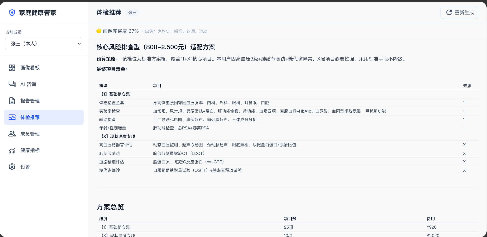
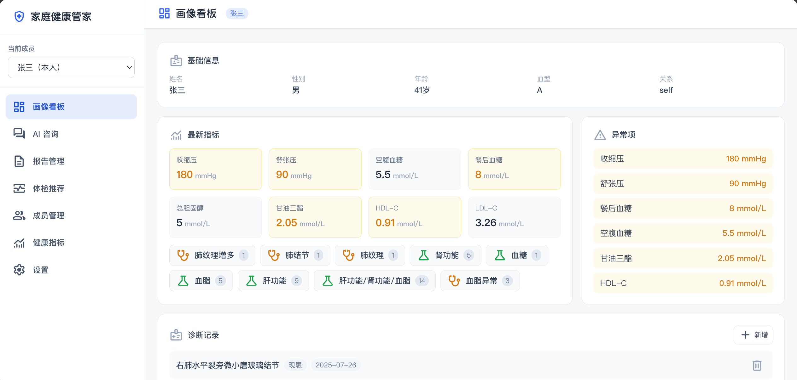
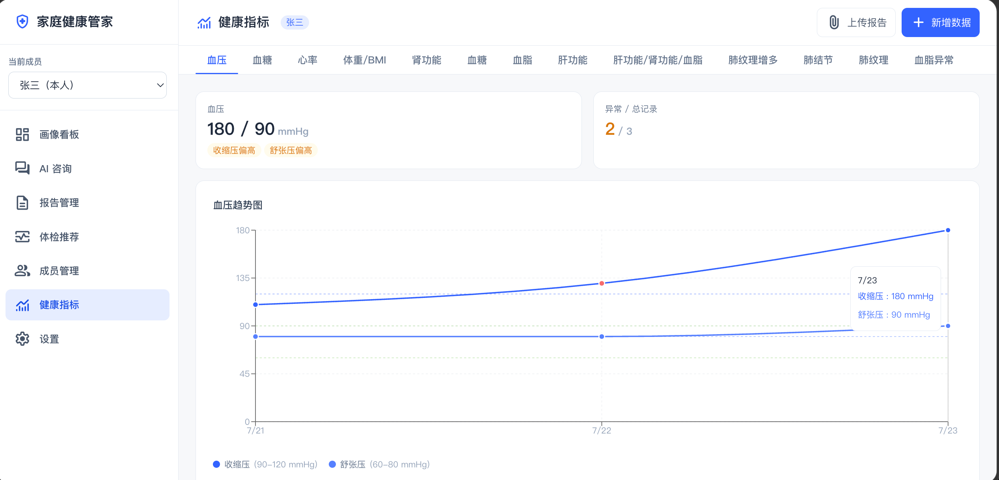

# AI Health Steward

> Open-source, self-hosted family AI health manager. Structures health data into a per-person health profile via multimodal LLMs, providing visual dashboards and AI consultations, with multi-channel support (Feishu, etc.) for data collection and lightweight Q&A.

[](LICENSE)

[中文文档](README.md)

## Features

- **Self-hosted & Private** — All health data stays on your local server, fully under your control
- **Multimodal Report Import** — Upload photos of medical reports, lab results, or prescriptions; AI automatically extracts structured key metrics with user confirmation
- **Person-Level Health Profile** — A–H field families (basic info / physiological metrics / diagnoses / medications / allergies / lifestyle / family history / data provenance) as a single source of truth
- **AI Health Consultation** — Intent routing via function calling, answers based on your actual profile data — not a generic chatbot
- **Metric Trend Visualization** — Blood pressure, blood glucose, heart rate, weight/BMI trend charts with abnormal markers
- **Personalized Checkup Recommendations** — Generates customized checkup plans based on health profiles using the 1+X+Y framework (core basics / condition-specific / risk screening), with budget tier selection and safety contraindication checks
- **Lab & Exam Tracking** — Lab results grouped by report name with per-test charts; exam findings (e.g., pulmonary nodules) displayed on a timeline
- **Feishu Integration** — Configure multiple Feishu bots, each bound to a family member; WebSocket long-connection for message reception, supporting text Q&A and image report extraction
- **Pluggable Models** — Multimodal API (required) / Text API (optional) / Local LLM (optional), configured on demand
- **Family Multi-Member** — Single instance serves one family with isolated member data
- **Report Management** — Full report lifecycle (upload → AI extraction → confirm → archive), with three upload entry points: report page, metric page, and AI chat
- **Lab & Exam Tracking** — Lab metrics grouped by report with per-test trend charts; exam findings displayed on a category timeline
- **AI Image Interpretation** — Send report images in chat; AI extracts structured data first, then provides professional interpretation based on the extracted data, with one-click archiving
- **Report Semantic Search (RAG)** — Archived reports are automatically vectorized; AI consultations can semantically retrieve historical report content
- **System Settings** — Visual management of model configs, health checks, data export/wipe via the UI; changes take effect immediately

## Quick Start

### Prerequisites

- Docker 20.10+ and docker-compose v2+
- Model API Key (OpenAI-compatible endpoint, e.g., GPT-4o / DeepSeek)
- Minimum: 2 CPU cores / 2GB RAM / 10GB disk

### Deployment

```bash
# 1. Clone the repository
git clone https://github.com/wangzhengpengjay/AI-Health-Steward.git
cd AI-Health-Steward

# 2. Copy environment config and fill in credentials
cp .env.example .env
# Edit .env — at minimum, set MULTIMODAL_API_KEY and TEXT_API_KEY

# 3. Sync config to backend/.env
cp .env backend/.env

# 4. One-command startup
docker compose up -d

# 5. Initialize database (first deploy)
docker exec health-steward-backend alembic upgrade head

# 6. Access
# WebUI: http://localhost:5173
# API Docs: http://localhost:8000/docs
```

### Quick Trial

```bash
# Import demo data (optional)
docker exec health-steward-backend python -m scripts.seed_demo_data
```

See [Deployment Guide](DEPLOYMENT.md) for detailed instructions.

## Tech Stack

| Layer | Technology |
|-------|-----------|
| Backend | Python 3.12 + FastAPI |
| Frontend | React 18 + Vite + TypeScript + TailwindCSS |
| Database | PostgreSQL 16 + pgvector |
| ORM | SQLAlchemy 2.0 + Alembic |
| AI | OpenAI-compatible API (multimodal/text) + Ollama (local LLM) |
| Deployment | Docker Compose |

## Project Structure

```
AI-Health-Steward/
├── backend/                 # Python FastAPI backend
│   ├── app/
│   │   ├── api/             # API routes
│   │   ├── core/            # Config, database
│   │   ├── models/          # SQLAlchemy models
│   │   ├── schemas/         # Pydantic schemas
│   │   ├── services/        # Business logic (AI consultation, Feishu channel)
│   │   ├── prompts/         # AI prompt templates
│   │   └── providers/       # Model provider abstraction
│   ├── alembic/             # Database migrations
│   └── tests/               # Tests
├── frontend/                # React frontend
│   └── src/
│       ├── components/      # UI components
│       ├── pages/           # Pages
│       ├── lib/             # API client, utilities
│       ├── stores/          # Zustand state management
│       └── types/           # TypeScript types
├── docker-compose.yml
├── .env.example
└── README.md
```

## Roadmap

| Version | Goal | Status |
|---------|------|--------|
| V0.1 | Project scaffold & data foundation | ✅ Done |
| V0.2 | AI consultation — intent routing, tool calling, chat UI | ✅ Done |
| V0.3 | Report import & visualization — multimodal extraction, trends, dashboard, report management, checkup recommendations, RAG | ✅ Done |
| V0.4 | Feishu channel — multi-channel management, data collection, lightweight Q&A | ✅ Done |
| V1.0 | Open-source release — docs, one-click deploy | 🔧 In Progress |

## Screenshots





## Privacy

- **Data Storage**: All health data is stored on your local server — nothing is uploaded to the cloud automatically
- **Model API Calls**: Conversation content and report images are sent to your configured model API provider. For fully offline operation, configure a local LLM (e.g., Ollama)
- **Data Control**: Users can view, modify, export, or delete all data at any time

See [Privacy Statement](PRIVACY.md) for details.

## Contributing

Issues and PRs are welcome! Please read the [Contributing Guide](CONTRIBUTING.md) first.

## Documentation

- [Deployment Guide](DEPLOYMENT.md) — Docker setup, configuration, Feishu bot setup
- [Developer Guide](DEVELOPMENT.md) — Architecture, extension guides (Provider / Tools / Channels)
- [Privacy Statement](PRIVACY.md) — Data storage and model API boundaries
- [Contributing Guide](CONTRIBUTING.md) — Dev environment and code conventions

## License

[MIT](LICENSE)
