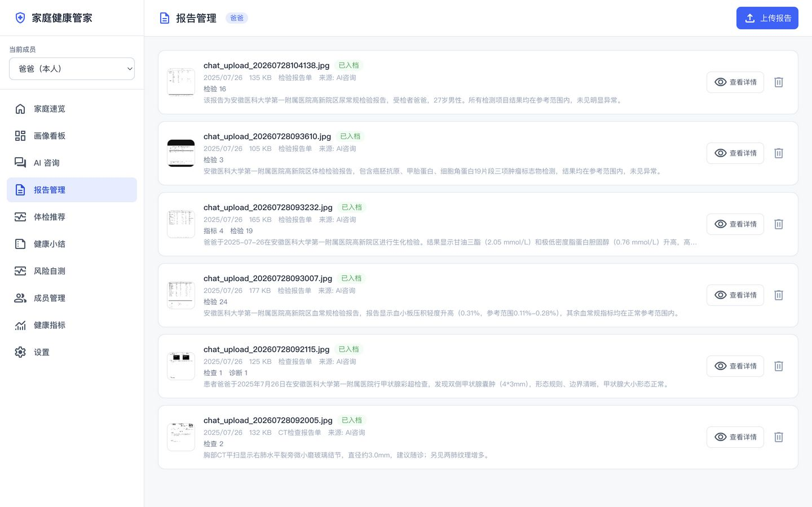

# AI Health Steward

**Your health. Your data. Your AI. — fully self-hosted.**

> Open-source, private, self-hosted family AI health steward. Multimodal AI structures your family's health data into per-person health profiles, with a visual dashboard and AI consultations grounded in real data — deployed on *your* server, never a closed platform.

[](LICENSE)
[](DEPLOYMENT.md)
[](backend)
[](frontend)
[](docker-compose.yml)

[中文文档](README.md)

---

## Why self-hosted? Privacy is the whole point.

Most health apps are black boxes: your lab results, diagnoses, and medications get uploaded to someone else's cloud and monetized. **AI Health Steward is the opposite.**

- 🔒 **Your data never leaves your server** — health records, reports, and profiles live entirely on hardware you control. Nothing is uploaded to any cloud automatically.
- 🏠 **One instance serves your whole family** — multi-member with fully isolated data.
- 🧠 **Bring your own AI** — plug in any OpenAI-compatible model (GPT-4o, DeepSeek, etc.) *or* run fully offline with a local LLM (e.g. Ollama). When you use a cloud model, only the specific query and image you send go to *your* chosen provider — and you can opt out entirely.
- 🗄️ **Total data control** — export everything as JSON anytime, or delete records with a soft-delete safety net.

> A health record is the most sensitive data you own. It should not be a product. It should live on your shelf.

---

## Features

- **Self-hosted & Private** — all health data stays on your local server, fully under your control; optional Bearer-token auth + per-member rate limiting
- **Multimodal Report Import** — upload photos of medical reports, lab results, or prescriptions; AI extracts structured key metrics with your confirmation
- **Person-Level Health Profile** — A–H field families (basic info / physiological metrics / diagnoses / medications / allergies / lifestyle / family history / data provenance) as a single source of truth
- **AI Health Consultation** — intent routing via function calling; answers grounded in your actual profile data — not a generic chatbot
- **Metric Trend Visualization** — blood pressure, blood glucose, heart rate, weight/BMI trend charts with abnormal markers and clinical **critical-value alerts** (e.g. BP ≥180/110)
- **Age-Tiered Reference Ranges** — normal ranges auto-matched to adult vs. child to avoid misjudging kids' metrics
- **Personalized Checkup Recommendations** — 1+X+Y framework (core basics / condition-specific / risk screening), budget tiers, safety/contraindication checks
- **Periodic Health Summaries** — auto weekly/monthly/yearly reports with trends, anomalies, and follow-up items
- **Risk Self-Assessment** — built-in PHQ-9, GAD-7, diabetes, and ASCVD (cardiovascular) scales
- **Follow-up / Medication Reminders** — auto-generated todo tasks (recheck / medication / follow-up / appointment)
- **Report Management** — full lifecycle (upload → AI extraction → confirm → archive); three upload entry points
- **Lab & Exam Tracking** — lab metrics grouped by report with per-test charts; exam findings on a category timeline
- **AI Image Interpretation** — send report images in chat; AI extracts structured data, interprets it, one-click archive
- **Report Semantic Search (RAG)** — archived reports auto-vectorized for semantic Q&A over your history
- **Long-Term Conversation Memory** — each consultation rolls into a compressed per-member long-term memory
- **Feishu / Lark Integration** — multiple bots, one per family member; WebSocket for text Q&A and image parsing (great on mobile)
- **Dual-Entry Design** — WebUI is the full management backend; Feishu is the lightweight daily entry point; data flows between both automatically
- **Pluggable Models** — multimodal API / text API / local LLM, configured on demand
- **Cost Optimization** — eliminates duplicate metric-extraction LLM calls; skips LLM when a summary has no new data
- **System Settings** — manage models, health checks, data export/wipe from the UI

---

## Quick Start

### Prerequisites

- Docker 20.10+ and docker-compose v2+
- Model API Key (OpenAI-compatible endpoint, e.g., GPT-4o / DeepSeek)
- Minimum: 2 CPU cores / 2GB RAM / 10GB disk

### Deployment

```bash
# 1. Clone the repository
git clone https://github.com/wangzhengpengjay/AI-Health-Steward.git
cd AI-Health-Steward

# 2. Copy environment config and fill in credentials
cp .env.example .env
# Edit .env — at minimum, set MULTIMODAL_API_KEY and TEXT_API_KEY

# 3. Sync config to backend/.env
cp .env backend/.env

# 4. One-command startup
docker compose up -d

# 5. Initialize database (first deploy)
docker exec health-steward-backend alembic upgrade head

# 6. Access
# WebUI: http://localhost:5173
# API Docs: http://localhost:8000/docs
```

### Quick Trial

```bash
# Import demo data (optional)
docker exec health-steward-backend python -m scripts.seed_demo_data
```

See [Deployment Guide](DEPLOYMENT.md) for detailed instructions.

---

## Tech Stack

| Layer | Technology |
|-------|-----------|
| Backend | Python 3.12 + FastAPI |
| Frontend | React 18 + Vite + TypeScript + TailwindCSS |
| Database | PostgreSQL 16 + pgvector |
| ORM | SQLAlchemy 2.0 + Alembic |
| AI | OpenAI-compatible API (multimodal/text) + Ollama (local LLM) |
| Deployment | Docker Compose |

---

## Project Structure

```
AI-Health-Steward/
├── backend/                 # Python FastAPI backend
│   ├── app/
│   │   ├── api/             # API routes
│   │   ├── core/            # Config, database
│   │   ├── models/          # SQLAlchemy models
│   │   ├── schemas/         # Pydantic schemas
│   │   ├── services/        # Business logic (AI consultation, Feishu channel)
│   │   ├── prompts/         # AI prompt templates
│   │   └── providers/       # Model provider abstraction
│   ├── alembic/             # Database migrations
│   └── tests/               # Tests
├── frontend/                # React frontend
│   └── src/
│       ├── components/      # UI components
│       ├── pages/           # Pages
│       ├── lib/             # API client, utilities
│       ├── stores/          # Zustand state management
│       └── types/           # TypeScript types
├── docker-compose.yml
├── .env.example
└── README.md
```

---

## Roadmap

| Version | Goal | Status |
|---------|------|--------|
| V0.1 | Project scaffold & data foundation | ✅ Done |
| V0.2 | AI consultation — intent routing, tool calling, chat UI | ✅ Done |
| V0.3 | Report import & visualization — multimodal extraction, trends, dashboard, report management, checkup recommendations, RAG | ✅ Done |
| V0.4 | Feishu channel — multi-channel management, data collection, lightweight Q&A | ✅ Done |
| V1.0 | Open-source release — docs, one-click deploy, hardening (age-tiered ranges / critical-value alerts / family overview / long-term memory / auth & rate limiting) | 🔧 In Progress |

---

## Screenshots

> Screenshots below use sample data. Real names are anonymized to protect privacy.





---

## Privacy

- **Data Storage**: All health data is stored on your local server — nothing is uploaded to the cloud automatically
- **Model API Calls**: Conversation content and report images are sent to your configured model API provider. For fully offline operation, configure a local LLM (e.g., Ollama)
- **Data Control**: Users can view, modify, export, or delete all data at any time

See [Privacy Statement](PRIVACY.md) for details.

---

## Contributing

Issues and PRs are welcome! Please read the [Contributing Guide](CONTRIBUTING.md) first.

## Documentation

- [Deployment Guide](DEPLOYMENT.md) — Docker setup, configuration, Feishu bot setup
- [Developer Guide](DEVELOPMENT.md) — Architecture, extension guides (Provider / Tools / Channels)
- [Privacy Statement](PRIVACY.md) — Data storage and model API boundaries
- [Contributing Guide](CONTRIBUTING.md) — Dev environment and code conventions

## License

[MIT](LICENSE)